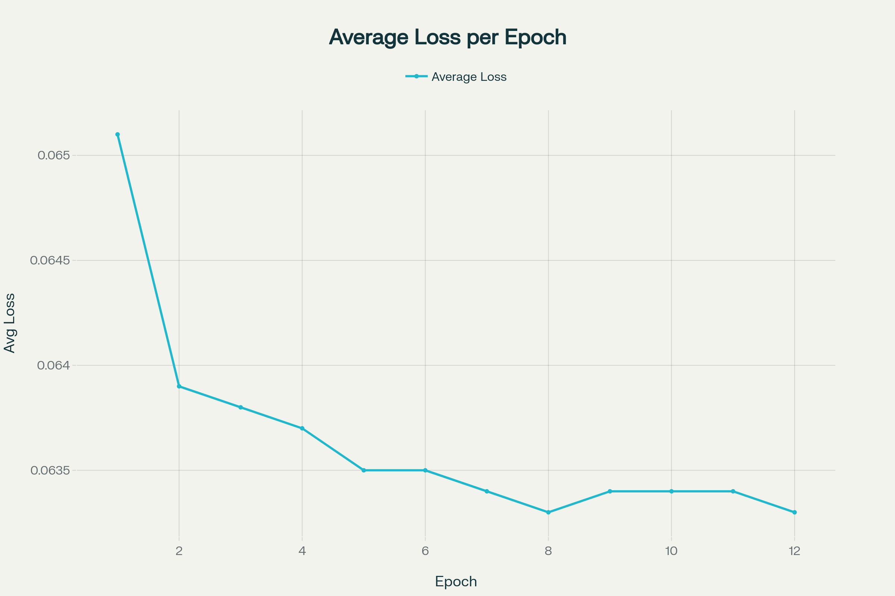
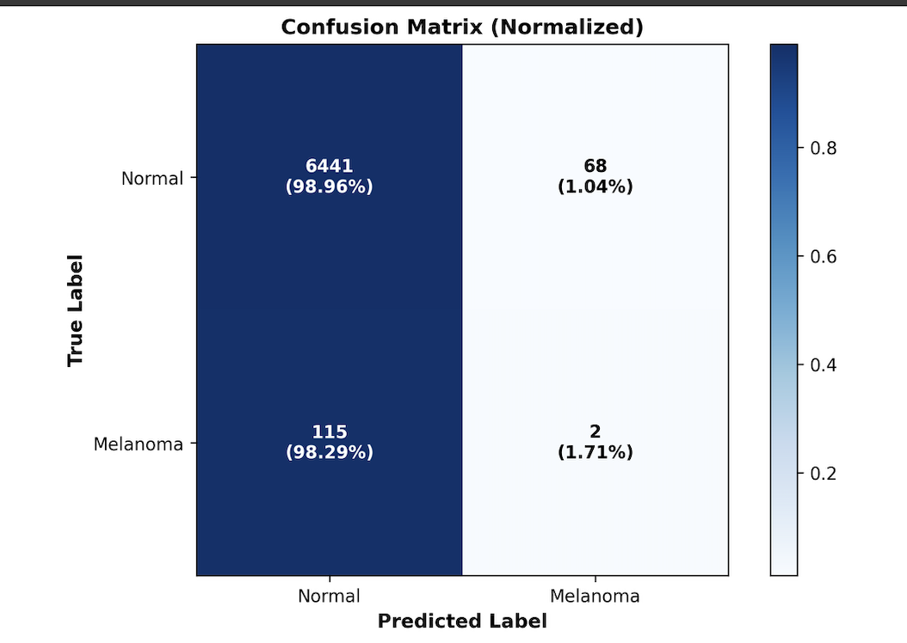
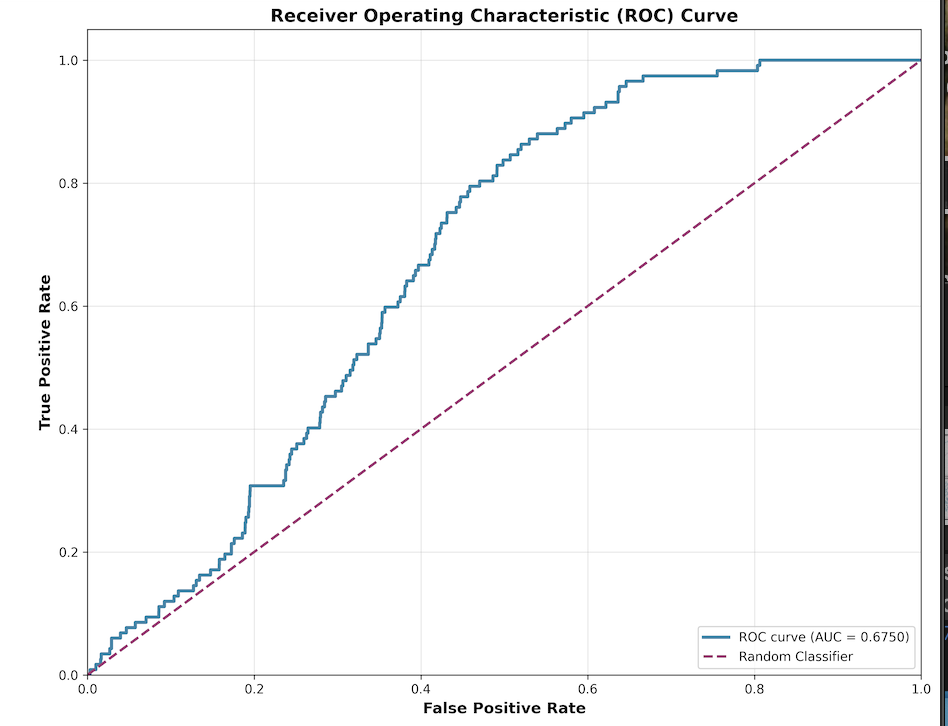
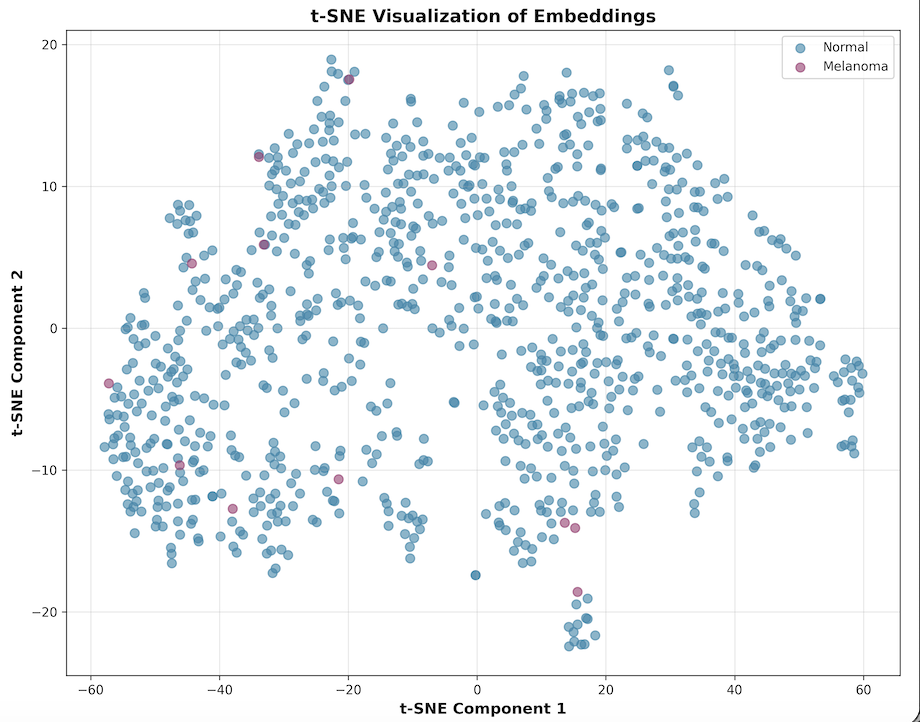

# Siamese Network Classifier for Skin Lesion Images

## Project Description
Siamese network is a neural network that is currently widely used in facial recognition. [1] The network trains by creating pairs, labeling them as similar or dissimilar. Then each image will be processed through convolution layers outputting embedding vectors. Capturing the patterns and the key features of this image. The machine will compare between embedding vectors using distance matrices and determine the contrastive loss. If the images are similar, the loss is small, if different the loss will be large. Through training, the network learns to minimize the contrastive loss with similar pairs and to improve its ability to identify similar and different images effectively. 

This project will be implementing a Siamese network aiming to differentiate between benign skin and melanoma skin cancer through learning “The ISIC 2020 Challenge Dataset”. The goal is to achieve an 80% accuracy by classifying skin images either being benign or melanoma.

## Dataset

This project uses the **ISIC 2020 Challenge Dataset**.

### Files to Download

- **Training Images:** JPEG format (~23GB)  
- **Training Labels:** ISIC_2020_Training_GroundTruth.csv (~2MB), contains image names, diagnosis, and patient metadata  
- **Test Images:** JPEG format (~6.7GB)  
- **Test Labels:** ISIC_2020_Test_Metadata.csv (~458KB)

> **Note:** Please do **not** download the DICOM files as they require special software to process and don't need for this project

### Dataset Access
The dataset is available here: [ISIC 2020 Challenge Dataset](https://challenge2020.isic-archive.com/)

### Data Transformation

This project applies two types of data transformations to the images:

- **Preprocessing**:  
  Images are resized to a fixed size (e.g., 128x128 pixels) and normalized to standardize pixel values for consistent input to the network.

- **Augmentation**:  
  The ISIC 2020 Challenge Dataset contains 33,126 dermoscopic images, with a significant class imbalance. Approximately 26,033 benign images and only 467 melanoma images indicate a ratio of about 1 to 56. This extremely high imbalance will cause overfitting to the majority class, making it difficult to identify the minority class melanoma. To address this issue, data augmentation is needed to apply to the minority classes melanoma images. These augmentation will preserve the essential features of the image and but change the weights create new augmented images. 

## Data Directory Configuration
After downloading the entire dataset to your local machine, follow these steps:

- If you are running the project on your local machine, you can skip the upload step
- If running on a cloud server like [Vast.ai](http://vast.ai), upload the dataset files to your cloud drive

Next, create a configuration file (e.g., `config.py`) to specify the directory paths for your dataset files like this:
```
train_image = 'path/to/train/images'
train_labels = 'path/to/train/labels'
```
Make sure to update these paths according to where the data is stored on your server


### Environment Setup and GPU Requirements

This project was developed and tested using a Vast.ai GPU server with an NVIDIA RTX 5090 (CUDA 13.0) and PyTorch running with CUDA 12.9.1+.

#### Minimum System Requirements
- **GPU:** NVIDIA GPU with CUDA capability (version 11.8 or higher recommended)  
- **CUDA Toolkit:** Version 11.8 or newer  
- **RAM:** At least 32GB (recommended for handling large image datasets)  
- **Storage:** Minimum 30GB free disk space for ISIC dataset and outputs  
- **Python:** Version 3.8+  
- **Frameworks:** PyTorch 2.1+, torchvision 0.16+, along with other compatible packages  

---

### PyTorch Installation

On [Vast.ai](http://vast.ai), PyTorch is pre-installed already in the environment 

If you are using a local machine or another server without PyTorch pre-installed, please follow the official installation guide:  
[PyTorch Installation Guide](https://pytorch.org/get-started/locally/)

---

### Package Installation

Install essential Python packages with pip:
```
pip install pandas pillow numpy matplotlib scikit-learn seaborn
```

### Package Versions Used

- PyTorch version: 2.8.0+cu128  
- Torchvision version: 0.23.0+cu128  
- Pandas version: 2.3.3  
- Pillow version: 11.0.0  
- NumPy version: 2.1.2  
- Matplotlib version: 3.10.7  
- Scikit-learn version: 1.7.2
- Seaborn version: 0.13.2


## Dataset Module

Create a directory for data. This data will handle all the loading and preparing data to be passed in the model. 

### Dataset module structure

**1. Loading Dataset**

  Create a constructor class (`__init__`).  This class is responsible for preparing all the dataset whenever it is requested. Specifying the directory and setting up transformation and augmentation
  
**2. Create labels**

  Convert all the diagnosis classes in “ISIC_2020_Training_GroundTruth.csv” into binary labels melanoma being 1 and benign is 0. Since neutral network can only process numerical inputs 
  
**3. Image pairing**

  Since the train images are in a folder. The function `os.listdir ` is being used to read all the images file names. Then images will be paired according to their class. This allows the network to learn the key features, similarities and differences between melanoma and benign images.
  
**4. Dataset balancing / Augmentation**

  To address the class imbalance. We set up a framework for augmenting the minority class melanoma. At this stage we are just computing how much augmentation images are needed to balance the dataset through the oversampling factor. Which can we calculate through the ratio of benign and melanoma images. Furthermore, we will also be tracking how much augmented images are being produced making sure it does not exceed the required amount of balancing
  
**5. Data Access**

  Here we are preparing the data to be compared. By defending a class  `__getitem__`. First the first image is chosen based on the given index. Then, the network will decide whether the pair should be the same class or different class.  Last, second image will be chosen randomly from the dataset including the augmented one corresponding the given pair type 

## Model Modulue

Create a directory for the Siamese model . This part we are setting up convolution layers and contrastive loss

**1. Convolution layer**

conv1: 3 input channels, 16 output channels, 3x3 kernel

conv2: 16 input channels, 32 output channels, 3x3 kernel

conv3: 32 input channels, 64 output channels, 3x3 kernel

**2. Maxpooling and ReLu**

`ReLu` to sets all negative values in the feature map to 0
`2x2 max pooling` is used to keep most significant features in the kernel
**3. Flatten**

Convert 3 dimensional features map to 1 dimensional vector

**4. Fully connected layers**

`fc1`: Linear mapping all the vectors to 512 neurons 
`fc_emedding`: The final fully connected layers which produce the final output embeddings

**5. Constrastive Loss**

  A Custom loss function that computes Euclidean distance between the paired embeddings. The goal is to make the distance between similar pairs lower than the predefined margin, and push the different pairs further apart. 

## Train Process

Implemented in [train.py](train.py). This section trains the Siamese Network model using PyTorch.

### Hyperparameters

- **Batch size:** 256 (optimized for RTX 5090)
- **Learning rate:** 1e-4
- **Number of epochs:** 12
- **Margin for contrastive loss:** 0.5
- **Embedding dimension:** 128

### Training Loop

For each epoch:
- Iterate over batches:
  - Move images and labels to the selected device (GPU or CPU).
  - Zero the optimizer's gradients.
  - Forward pass the image pairs through the model to obtain embeddings.
  - Calculate loss using the contrastive loss criterion.
  - Perform backpropagation and update model weights.
  - Log batch loss intermittently.
- Compute and print average loss at the end of each epoch.




## Prediction and Analysis

###1. Accuracy score

- The overall correctness of the predicting which class this image it is
- Can be misleading with imbalance datasets
- Goal to reach a 80% accuracy

###2. f1-score

- The harmonic mean of precision and recall
- Balances the trade-off between catching positive cases and having few false alarms

###4. Spcificity 

- Proportion of actual negatives correctly identified by the model

###3. Confusion Matrix

- Visulaize how many samples were correctly and incorrectly classified as each class
- Shows true positives, false positives, true negatives, and false negatives

###5. ROC/AUC curve 

- Plots the trade-off between true positive rate (sensitivity) and false positive rate at all thresholds
- AUC ((Area Under ROC Curve) it summarize the ability of the model to distinguish classes
  
###5. T-SNE graph

- Shows how well the model learn features separate classes distinct clusters indicate strong separation

## Results and Analysis

### Confusion Matrix

*Figure 1: Confusion Matrix of Siamese Network*




#### Analysis

**Normal Lesions:**  
- Correctly identified: 6,441 images (98.96%)  
- Misidentified: 68 images (1.04%)  

**Melanoma:**  
- Correctly identified: 2 images (1.71%)  
- Misidentified: 115 images (98.29%)  

**Overall Accuracy:**  
- Overall accuracy appear high due to 97.2% due to normal class dominating the data
- But Melenoma miss 98% of the class

**Clinical Priority:**  
- However it is better to be false positive rather than false negative because you would rather know you might be sick and be aware, rather than not know anything and suddenly die. In my model the error is acceptable, because a false positive can trigger review by a human expert rather than allowing a dangerous miss.
- My model currently produces mostly false negatives for melanoma, which is NOT acceptable in a real clinical setting because it would mean most dangerous cases are missed
  

---

### ROC curve

*Figure 2: Receiver Operating Characteristic Curve of Siamese Network*



#### Analysis
- AUC Score: 0.675
- My model shows the ROC curve stays above random line most of the thresholds, indicaiting that it perform bettter then random guess however it is not perfect yet
- AUC captures more true positive near the end of the curve 
- A factor limiting the AUC score is the class imbalance of the test data, my model can lean more toward predicting the majority class, reducing its scoring ability

---

### t-SNE Visualization of Emeddings 

*Figure 3:  t-SNE plot of embeddings from Siamese Network




#### Analysis
- A very scatter cluster of benign and malignant classes
- Some overlap and mixing which suggests either both classes share common features or model is uncertain
- The overall structure doesnt suggest my model learn in a efficent way

---

## Model Validation Results

### Final Validation Accuracy
- Accuracy: 97.24%
- Correct Predictions: 6443 / 6626

### Confusion Matrix
|                      | Predicted Melanoma | Predicted Normal |
|----------------------|--------------------|------------------|
| **Actual Melanoma**   | 2 (True Positive)   | 115 (False Negative) |
| **Actual Normal**     | 68 (False Positive) | 6441 (True Negative) |

### Metrics
- Precision (Melanoma): 0.0286
- Recall (Sensitivity): 0.0171
- Specificity: 0.9896
- F1 Score: 0.0214

### Class Distribution
- Actual Melanoma Cases: 117
- Actual Normal Cases: 6509

### Predictions
- Predicted Melanoma: 70
- Predicted Normal: 6556

### Summary
This model shows high overall accuracy mainly due to the class imbalance. However, the model produce a very low precision, recall, and F1 score which indicate it performs poorly at detecting melanoma cases, with many missed or misclassified instances. Imporvements are needed to on classifying melanoma cases.


## Future improvements:

- Address class imbalance, expand the augmentation more diverse, increase more combinations, and create more realistic melanoma images.

- Increase melanoma pairs more aggressively, even if false positives occur more frequently, it's better then false negative. Because false negatives are clinically more dangerous.

- Apply class weighting or focal loss in training to change misclassification of melanoma more heavily.

- Use a pretrained CNN backbone (like ResNet or EfficientNet) in the Siamese network to extract richer features from images.

- Focus training on challenging pairs that are visually similar to improve embedding discrimination.

---

## Reference:

[1] S. Benhur, “A Friendly Introduction to Siamese Networks | Built In,” builtin.com, Jan. 25, 2022.

[2] “The ISIC 2020 Challenge Dataset,” ISIC 2020 Challenge Dataset. 

[3] PyTorch, “PyTorch,” Pytorch.org, 2023. 

[4] “Rent GPUs | Vast.ai,” Vast AI. 

[5] GeeksforGeeks, “Understanding the Confusion Matrix in Machine Learning,” GeeksforGeeks, Oct. 15, 2017. 

[6] Kemal Erdem (burnpiro, “t-SNE clearly explained - TDS Archive - Medium,” Medium, Apr. 13, 2020. 

[7] R. Kundu, “F1 Score in Machine Learning: Intro & Calculation,” V7, Dec. 16, 2022. 

[8] shakes76, “Topic recognition - s48008361 Siamese Submission by TheNoZER0 · Pull Request #16 · shakes76/PatternAnalysis-2024,” GitHub, Nov. 19, 2024.

[9] A. A. Awan, “A Complete Guide to Data Augmentation,” DataCamp, Nov. 2022.

[10] J. Brownlee, “SMOTE for Imbalanced Classification with Python,” Machine Learning Mastery, Jan. 16, 2020.

[11] Sole, “Exploring Oversampling Techniques for Imbalanced Datasets,” Train in Data Blog, Mar. 20, 2023.
‌
‌
‌
‌


